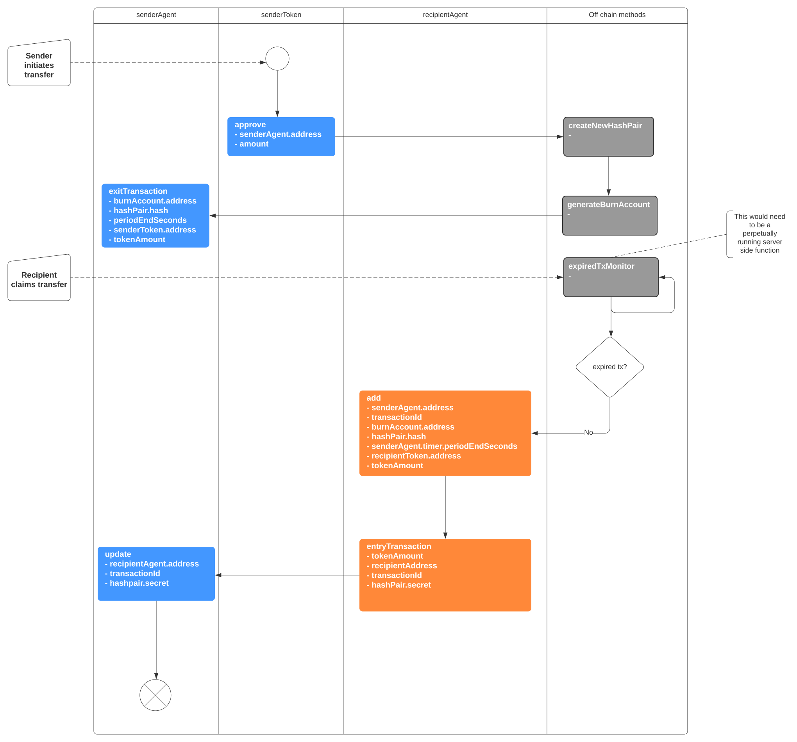
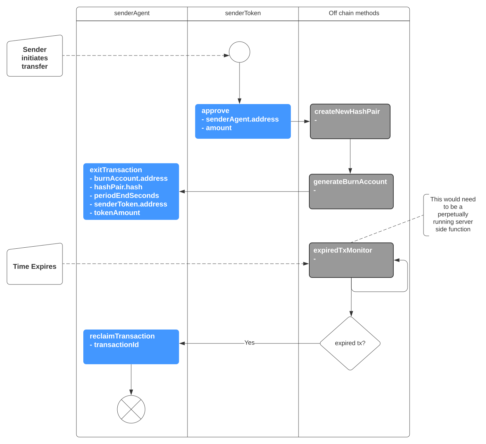

# Burn-to-Claim Demo App
### Cross-chain Value Transfer App using 'Burn-to-Claim' protocol by Babu Pillai

For the purposes of building this application, knowledge of the protocol is not really required. All the protocol does is transfer value (eg ERC20 tokens) from one blockchain to another OR timeout and return the funds.

For a successful transfer, there are 5 method calls to the blockchain. 

For a failed transfer there are 3. 

More are involved on initial setup. For the full data flow diagram, refer to './architecture/diagrams/BTC2022.svg'.

## The node.js version

A repo was built in 2020 which uses a node.js console application to demonstrate the 'happy path' for a successful transfer. See burn-to-claim.

## Objective 1 - Construct UI forms for each method (step) in the dataflow diagram.

The main purpose of this repo is to take some of the console application code and use it to construct a complete React UI application.

#### NB

Ignore everything in the root directory (/) for now. The React application is located in '/client'.

