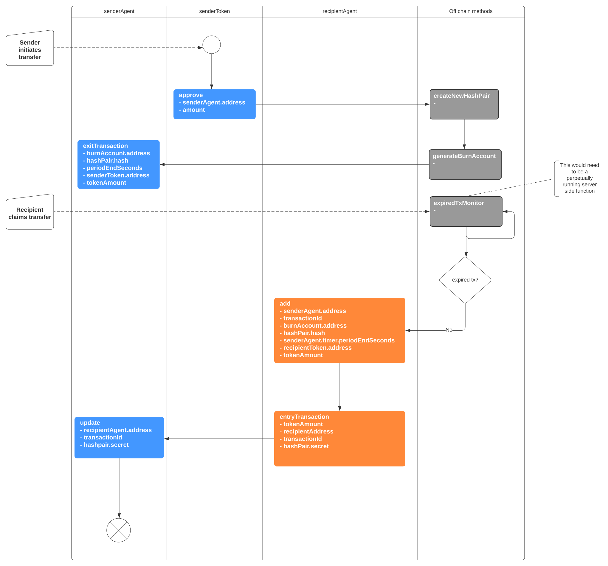
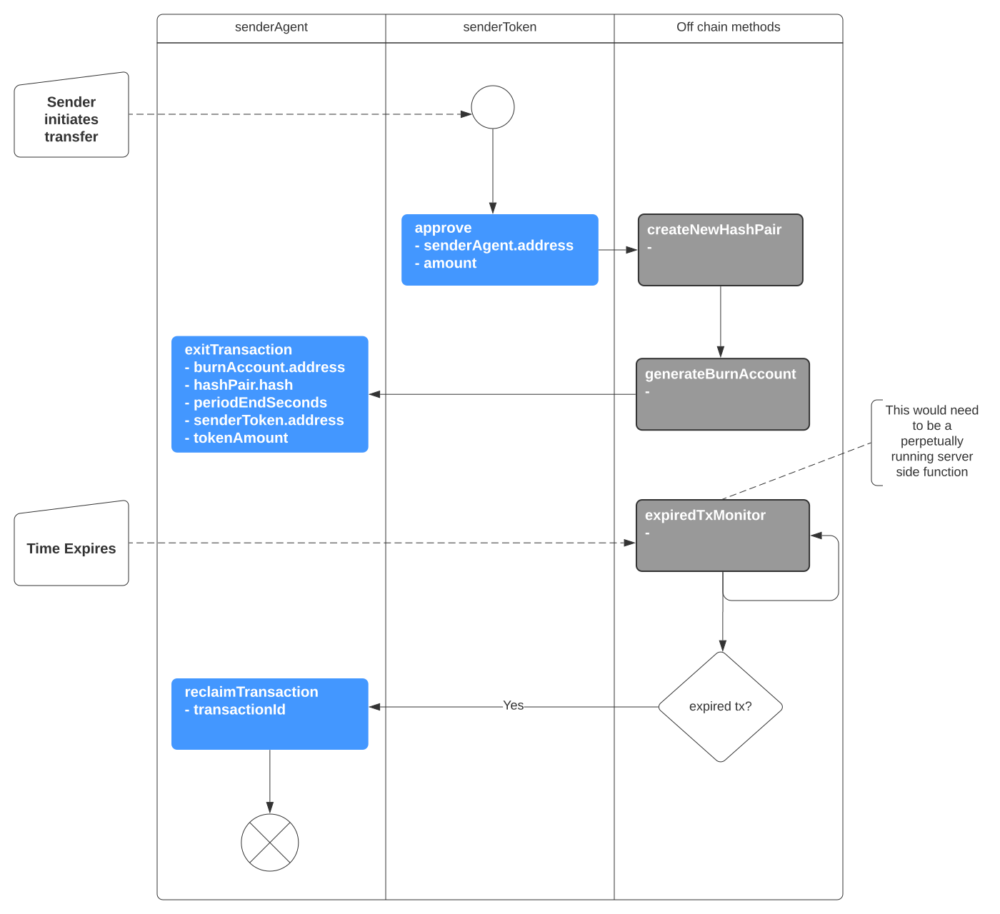
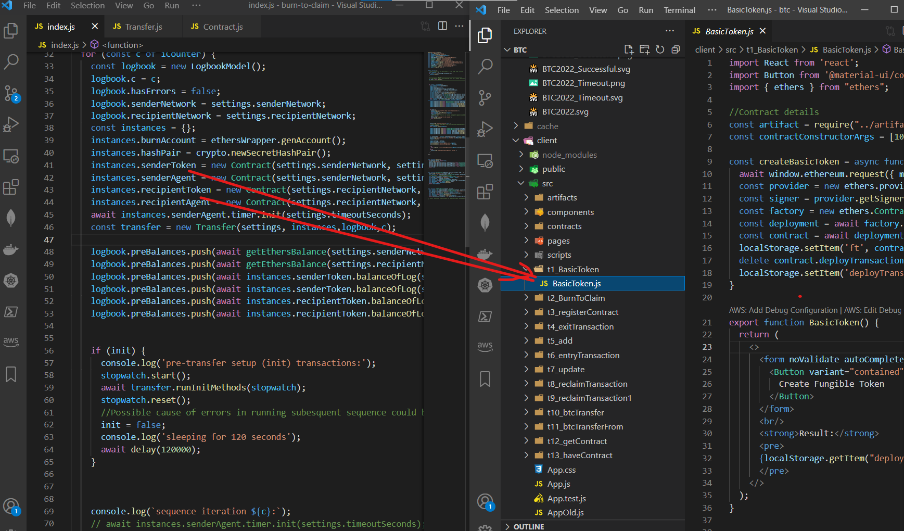

# Burn-to-Claim Demo App
### Cross-chain Value Transfer App using [Burn-to-Claim](https://www.sciencedirect.com/science/article/abs/pii/S1389128621004369) protocol by [Babu Pillai](https://scholar.google.ch/citations?user=Xtg1XHIAAAAJ&hl=en)

### Prerequisites
Intermediate level javascript and React programming knowledge is required.

Knowledge of [Smart Contract](https://ethereum.org/en/developers/docs/smart-contracts/) development is advantageous. To learn more, visit my [Youtube series](https://youtube.com/playlist?list=PLH7-GRFbhInbZmSubSoaqWz40nfOK0kyH) on the Ethers.js javascript library.

For the purposes of building this application, knowledge of the protocol is not required. 

### This App
This app implements the protocol on the Ethereum blockchain via [Smart Contracts](https://ethereum.org/en/developers/docs/smart-contracts/). For simplicity, and cost reasons, transfers will only take place between two testnet networks (Rinkeby & Ropsten).

### Burn-to-Claim Protocol
The function of the burn-to-claim protocol is to transfer value (eg ERC20 tokens) from one blockchain to another OR timeout and return the funds.

For a successful transfer, there are 5 method calls to the blockchain. 

For a failed transfer there are 3. 

More are involved on initial setup. For the full data flow diagram, refer to [BTC2022](https://severalpens.github.io/btc/docs/architecture/diagrams/btcvertical.svg).

### The node.js version

A [proof of concept repo](https://github.com/severalpens/burn-to-claim) was built in 2020 which uses a node.js console application to demonstrate the 'happy path' for a successful transfer.

### This version
The React app is located in `/client`.

The root directory (`/`) can be used to compile contracts and will eventually be used as a platform for integration testing using [Hardhat](https://hardhat.org/).

## Wireframes
Draft [wireframes](https://www.figma.com/file/57QEuRZprxs9rInc4j9C5M/BTC2022?node-id=0%3A1) have been created to demonstrate UIs from a functional perspective. ie I have no web design skills

## CSS
https://developer.mozilla.org/en-US/docs/Learn/CSS/Building_blocks/Organizing 
https://tailwind-elements.com/docs/standard/components/popover 
https://tailwindcss.com 

## Project Management 
### Checkpoint/Version 1 - PoC (Completed)
### Checkpoint/Version 2 - Setup template and build template form  (Completed)
### Checkpoint 3 - Construct UI forms for each method (step) in the dataflow diagram. (Completed)

The main purpose of this repo is to take some of the console application code and use it to construct a complete React UI application. 

For example, deploying the ERC20 tokens, relevant code from the node.js version can be recycled in the construction of a form which will do the same thing. However the user will have control over the variables such as `network` and `initial amount`:

